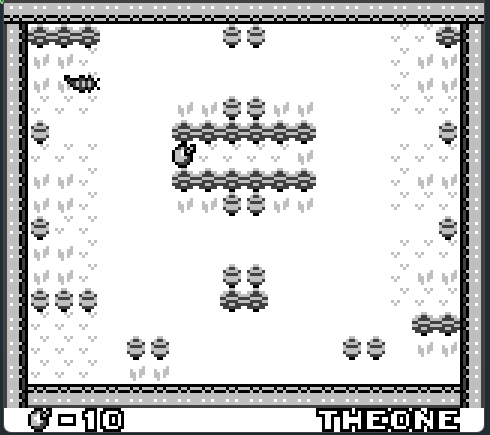

# BugAdventure---Gameboy-Sample

This sample project will help you to understand the main features and functions in gbdk library. Gameboy architecture is a powerful one, making games in this system is challenging but using gbdk make this task a lot easier especially if you're confortable with C language.

This tile based game is not perfect and it needs more optimization. However, you'll find what you need to start a basic game for gameboy ...

Requirement:
- gbdk 2020
- Clone this repo.
- Change the make.bat path to point to the compiler.
- Download BGB Emulator or Emulicious Emulator to run gb games.
- Run the compilation. Drag and drop the .gb into the emulator.

You are free to use my code as you please.

